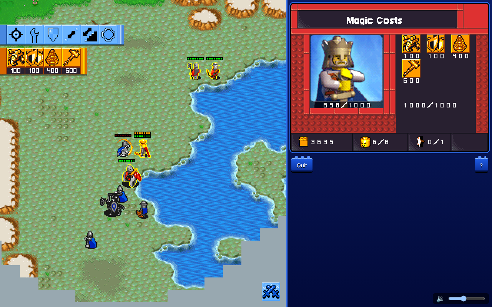
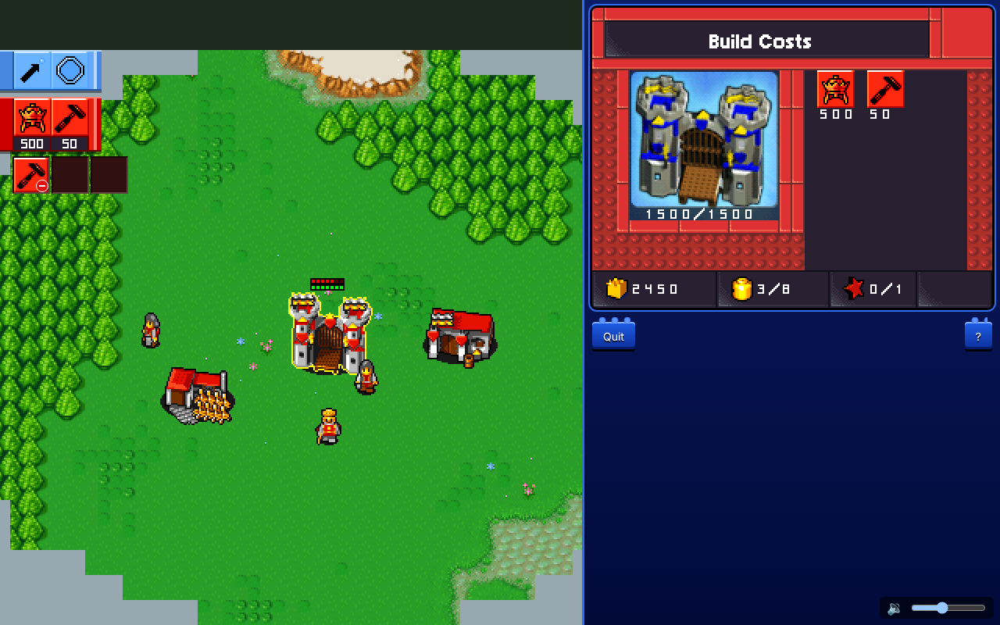
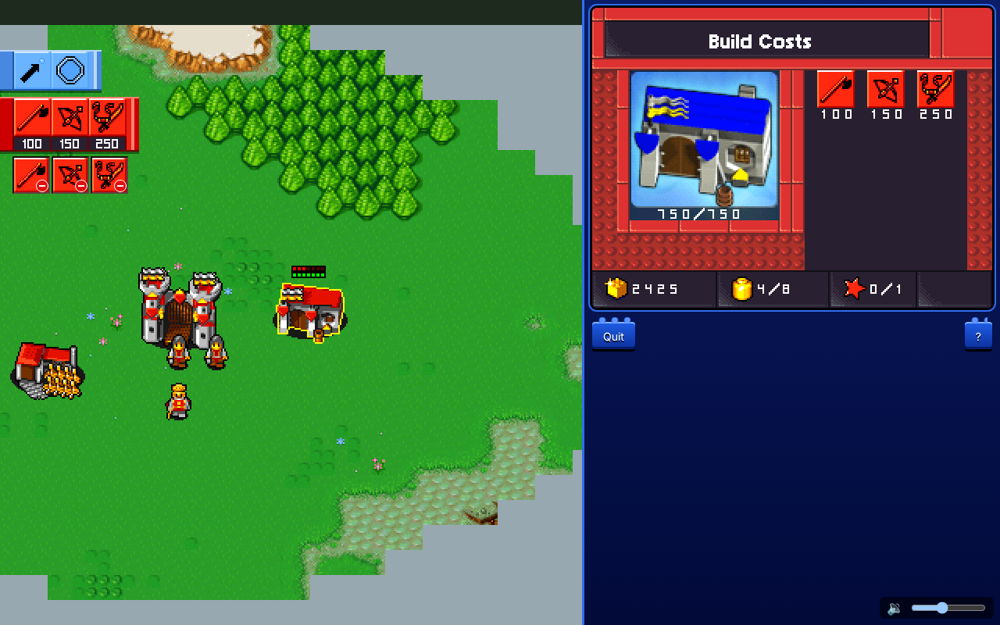
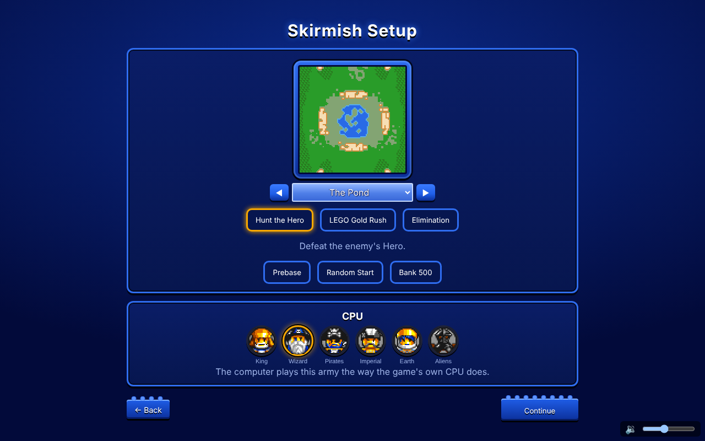
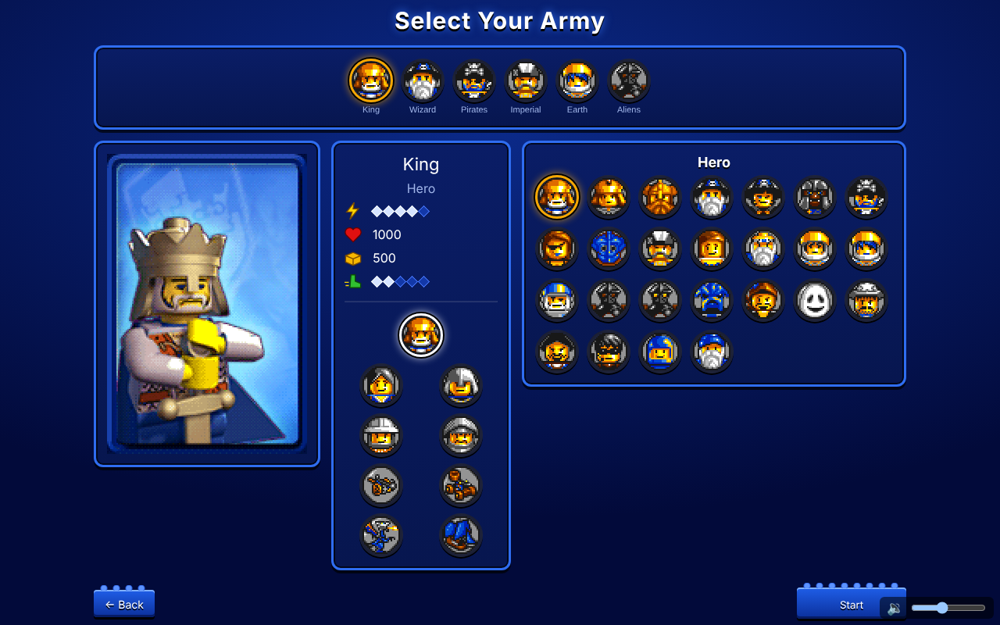
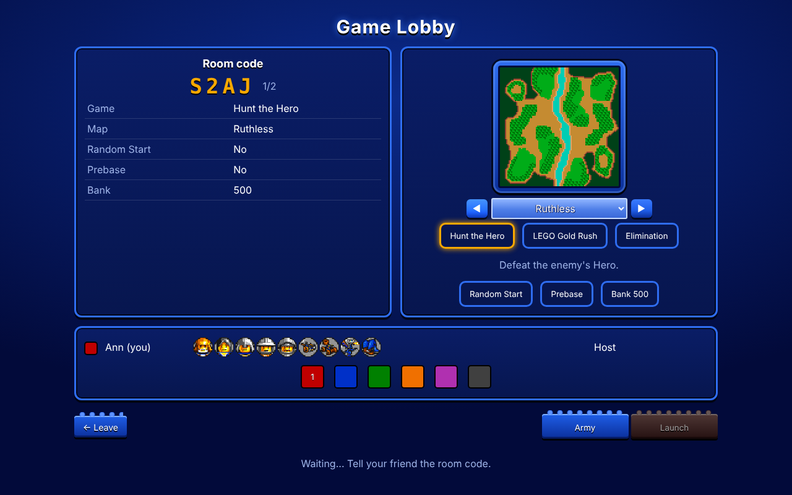
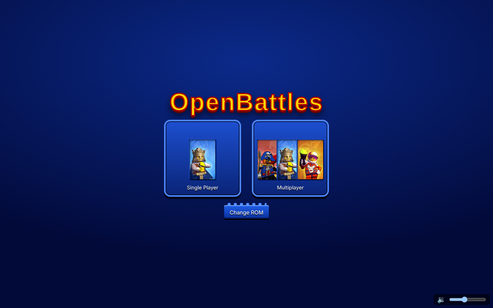
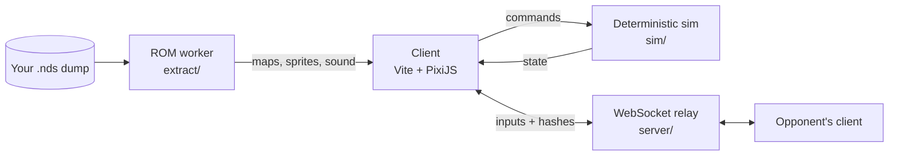

<div align="center">

# OpenBattles

**LEGO Battles (Nintendo DS, 2009), rebuilt for the browser from the original game's machine code, with 1v1 online play.**

[](https://github.com/James-Hillmann/openbattles/actions/workflows/ci.yml)


### [▶ Play the live demo](https://openbattles.onrender.com/)



</div>

OpenBattles is a clean-room style engine rewrite. The real-time strategy rules, unit stats,
pathfinding, AI, netcode and UI flow are reverse-engineered from the DS game's ARM9 binary,
checked against the real game running in an emulator, and rebuilt in TypeScript. Graphics, maps
and sound are decoded at runtime from the player's own ROM, in a Web Worker, in the browser.

> **You need your own dump of the game.** The page reads it locally; nothing from the game is
> uploaded, hosted or committed here. The demo runs on free hosting, so the first load can take
> about a minute to wake up.

## Highlights

- **Online 1v1 in the browser.** Host a room, share a four-letter code, pick armies, play.
  Deterministic lockstep over a small WebSocket relay, with desync detection by state hashes.
- **Faithful skirmish rules.** All six armies (King, Wizard, Pirates, Imperial, Earth, Aliens),
  heroes and their spells, economy, building and training queues, tower upgrades, repair, walls
  and bridges, transports, fog of war, map pickups, and the game's three modes (Hunt the Hero,
  LEGO Gold Rush, Elimination).
- **The game's own computer opponent**, ported from its AI classes rather than written fresh.
- **Assets decoded from the ROM in the browser**: maps, 4bpp sprite sheets, 3D models rendered to
  sprites (siege units, flyers, ships), fonts, UI layouts and the sound archive (effects, sequenced
  music and streams).
- **Every number has a source.** Findings are written up in [`docs/re-notes/`](docs/re-notes/) with
  the ARM9 address they came from and a confidence level (confirmed / likely / guess).

## Screenshots

<table>
  <tr>
    <td width="50%"><br><sub><b>Base building.</b> Castle selected, with its train strip and the DS-style top screen: portrait, minimap, bricks, population and heroes.</sub></td>
    <td width="50%"><br><sub><b>Training queue.</b> Barracks with three units queued; each can be cancelled from the strip.</sub></td>
  </tr>
  <tr>
    <td><br><sub><b>Skirmish setup.</b> Every skirmish map, the three game modes, Prebase, Random Start and starting bank, plus the CPU's army.</sub></td>
    <td><br><sub><b>Army select.</b> All six armies, with per-unit stats read from the game's tables.</sub></td>
  </tr>
  <tr>
    <td><br><sub><b>Online lobby.</b> Share the room code, pick a map, mode, team color and army, then launch.</sub></td>
    <td><br><sub><b>Main menu.</b> Single player against the computer, or online multiplayer.</sub></td>
  </tr>
</table>

<sub>Screenshots are of OpenBattles running with the author's own ROM dump; the game art shown is decoded at runtime from that ROM, and no game files ship in this repository.</sub>

## Architecture



| dir | what |
|---|---|
| [`sim/`](sim/) | Pure deterministic simulation: no DOM, no Pixi, no floats in game logic |
| [`client/`](client/) | Vite app: PixiJS renderer, input, menus, lobby, audio, the ROM loader worker |
| [`server/`](server/) | Node WebSocket relay: rooms, input forwarding, hash comparison; also serves the built client |
| [`extract/`](extract/) | ROM unpacking and DS format decoders; runs in a Web Worker and in Node |
| [`docs/re-notes/`](docs/re-notes/) | Reverse-engineering findings, function map, file formats |
| [`tests/`](tests/) | Vitest: unit tests, determinism replays, repo hygiene; Playwright end-to-end match |
| [`tools/`](tools/) | Headless emulator scripts and an AI-vs-AI runner |

### Determinism and lockstep

Both players run the same simulation and exchange only their inputs, the way the DS game itself
does over local wireless. That only works if every machine computes exactly the same thing:

- The sim runs at a fixed 30 ticks per second (the DS game updates every second VBlank).
- All game math is Q16.16 fixed point (`sim/src/fixed.ts`). No `Math.random`, `Date.now`, trig or
  unordered iteration; randomness comes from a seeded RNG stored in the world state.
- Inputs are scheduled a few ticks ahead to hide latency. A tick runs only when every player's
  input for it has arrived.
- Clients hash the world once a second; the relay compares hashes and stops the match on a
  mismatch, so a desync is caught at once instead of drifting.
- Determinism tests replay recorded input logs on independent worlds and require identical hashes
  on every tick, and a purity test rejects non-deterministic APIs in `sim/`.

## How the reverse engineering works

1. **Unpack the ROM.** The DS cartridge is a file system plus the ARM9 and ARM7 executables. Most
   game data sits in a custom compressed container, decoded in [`extract/src/pmoc.ts`](extract/src/pmoc.ts)
   (see [formats.md](docs/re-notes/formats.md)).
2. **Read the code.** The ARM9 binary (mixed 32-bit ARM and 16-bit Thumb instructions) is loaded
   into Ghidra at its RAM address. C++ RTTI names left in the binary point at the game's classes,
   which leads to the unit tables, commands and AI. Named functions go in
   [function-map.md](docs/re-notes/function-map.md).
3. **Check it in the emulator.** The real game runs headless in DeSmuME through `py-desmume`
   ([`tools/emu/`](tools/emu/)): scripted taps and key presses, RAM dumps, breakpoints and
   screenshots. A finding is only marked *confirmed* once the emulator agrees.
4. **Rebuild it.** The behavior is written up in our own words and reimplemented in `sim/` or
   `client/`. No decompiled code is copied into the repo.

## Run it locally

Needs Node 22+.

```sh
npm install
npm run dev        # client at http://localhost:5173
npm run server     # relay at ws://localhost:8787
```

Open the client, pick your ROM dump, and play a skirmish against the computer. For online play,
open two tabs: Host in one, Join with the room code in the other.

```sh
npm test           # unit + determinism tests
npm run typecheck
npm run e2e        # two browser tabs play one online match (OB_ROM=your.nds to use your dump)
npm run m0 -- path/to/your.nds   # unpack a ROM into ./out (gitignored) for exploring
```

To host your own server (one Node process serves the page and the relay), see
[docs/hosting.md](docs/hosting.md).

## Project rules

1. **Determinism.** `/sim` uses fixed point, the seeded RNG in world state, and arrays sorted by
   id. `tests/sim/purity.test.ts` enforces the obvious cases.
2. **Sim/render split.** The client reads sim state and interpolates; it changes it only through
   commands.
3. **Fixed tick** (`TICK_HZ`, 30) with inputs scheduled `INPUT_DELAY_TICKS` ahead.
4. **Desync detection.** Clients send `hashWorld()` every `HASH_INTERVAL_TICKS`; the relay
   broadcasts `desync` on mismatch and both clients stop.
5. **Lockstep.** Every player sends one input per tick (`sim/src/lockstep.ts`). Commands from the
   wire go through `sanitizeCommand`. Bump `PROTOCOL_VERSION` (`server/src/protocol.ts`) when sim
   rules change, so old and new builds don't get paired.
6. **No game data in git.** `.gitignore` covers ROMs and `out/`; `tests/repo-hygiene.test.ts`
   fails on anything that looks like a ROM or DS asset.

## Status

Playable today: skirmish against the computer and online 1v1 with every army. Still in progress:
some effect graphics, a few animation timings, and the remaining guesses listed in
[open-questions.md](docs/re-notes/open-questions.md). Story mode is out of scope.

## Legal

OpenBattles is an unofficial fan project, not affiliated with or endorsed by the LEGO Group,
Warner Bros. Games, TT Games, Hellbent Games, or Nintendo. It contains no game code or game files;
you need your own legally obtained copy of the game. The ROM is read in your browser and never
leaves your machine.
